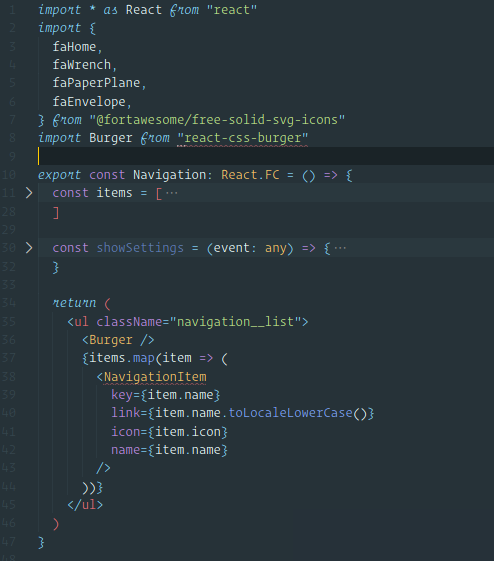
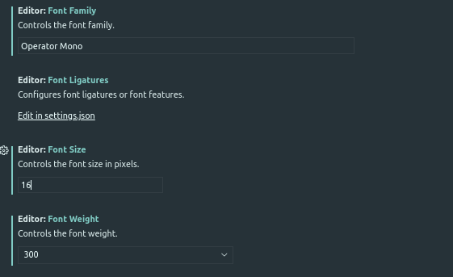

##  Operator-Mono



#### 1. Clone


    $ git clone git@github.com:lifeeric/Operator-Mono.git


#### installing On Linux

change the directory to `Operator-mono/src`

1) Copy the "Operator Mono" to `/usr/local/share/fonts/
```
cp -r Operator\ Mono /usr/local/share/fonts/
```
2) update the fonts, run this command
```
sudo fc-cache -fv
```

# Use the fonts



use the Operator Mono in vscode, setting search for font and put there "Operator Mono" without quotes
